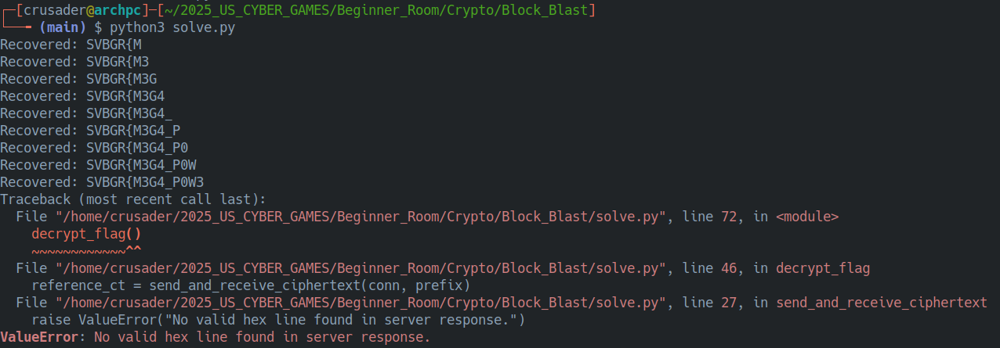
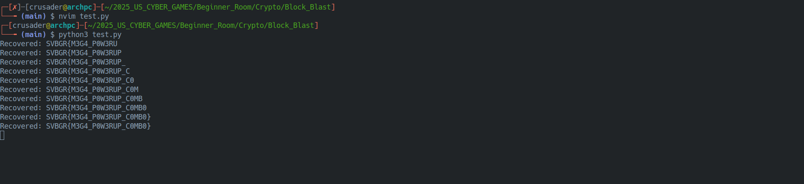

# 💣 Block Blast: Cracking the ECB Oracle!

The Block Blast challenge was a super cool crypto problem! We were given an encryption "oracle" — a server that would take our text, stick a secret flag on the end, encrypt it all with AES in ECB mode, and send back the jumbled result. Our mission: to cleverly pick our text and trick the oracle into revealing the flag, one byte at a time.

## 🕵️‍♂️ Cracking the Code: The Oracle's Weakness

The key to this whole challenge was the encryption mode: ECB. It's famous for being leaky because if you encrypt two identical blocks of text, you get two identical blocks of ciphertext. This pattern is a dead giveaway, and it's exactly what makes a byte-by-byte attack possible.

## 🤖 Getting a Little Help from my AI Friend

I'll be honest, crypto isn't my strongest suit. So, for this one, I teamed up with an AI to help me wrap my head around the attack. It was awesome for:

* Understanding how ECB's weakness could be exploited.
* Breaking the big problem down into small, manageable steps.
* Figuring out the logic to build a Python script to automate it all.

Working with AI made the tricky concepts click and helped me build the solution.

## 💥 Hitting a Snag (and Fixing It!)

My script hit an error after it figured out the first part of the flag

This is where I got to jump in and do some classic debugging! I realized I needed to feed the bytes I already knew back into the script for the next guess. I updated my `known` variable to `known = b'SVBGR{M3G4_P0W3'`, and bingo!

After that quick fix, the script ran perfectly and pulled out the full flag:

## ✅ Conclusion

This was a classic ECB oracle attack! It’s a perfect example of why choosing the right encryption mode is so important. Teaming up with AI was a game-changer; it didn't just give me the code, it helped me actually *learn* the concept. Even though crypto can be tough, this challenge proved that with the right approach (and a little help!), I can figure it out. What a blast!

