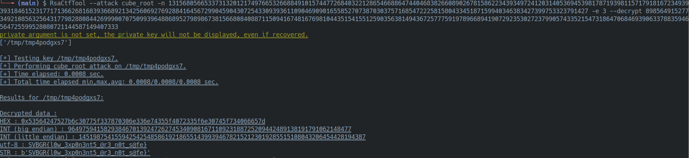

# 🔓 Gotta Go Low: The Classic RSA Low Exponent Trick!

The Gotta Go Low challenge was a classic crypto puzzle. We got an `encrypt.py` script and the encrypted flag, and the mission was to find the weakness in the RSA encryption to get the original message back.

## 🕵️‍♂️ Spotting the Weakness

Right away, looking at the `encrypt.py` script, one thing jumped out: the RSA public exponent was tiny (e = 3). This is a huge red flag in cryptography! When you use a super small exponent without any padding on the message, the encryption can sometimes be broken very easily.

## 🧠 The Game Plan: A Cube Root Attack

A quick google search led me to a great picoCTF write-up that explained a simple cube root attack. The logic was perfect for this challenge.

[Solution by ir0nstone](https://ir0nstone.gitbook.io/notes/writeups/picogym/cryptography/mini-rsa)

I just had to adapt the solution script to look for our `SVBGR` flag format instead of picoCTF's:

```python
if b'SVBGR' in flag:
```
Plugging in the ciphertext, the script worked like a charm and the flag appeared instantly.

## 🚀 Bonus Find: RsaCtfTool, My New Best Friend

During the competition, I also stumbled upon a powerhouse tool called RsaCtfTool. It automates a ton of RSA attacks, including this one! It made solving this even faster. With just one command, it cracked the message:

```Bash
RsaCtfTool --attack cube_root -n <modulus> -e 3 --decrypt <cipher_text>
```



This tool is definitely going into my arsenal for any future RSA challenges!

## ✅ Conclusion

I learned so much from this "quick" challenge! It was a great deep dive into a classic RSA attack. The biggest win for me was finding RsaCtfTool—it's amazing to walk away from a challenge with a powerful new tool for my arsenal. It really shows there's always something new to learn, even in a straightforward puzzle!
