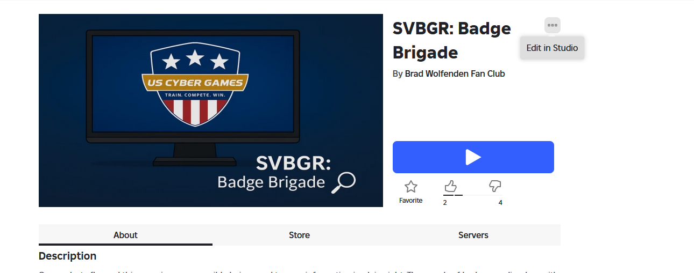
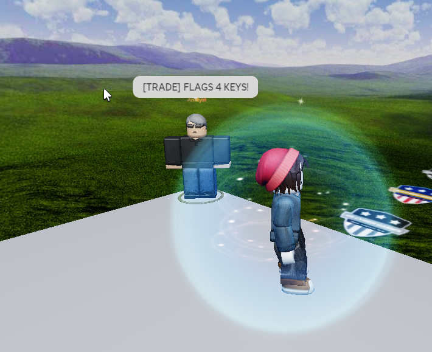
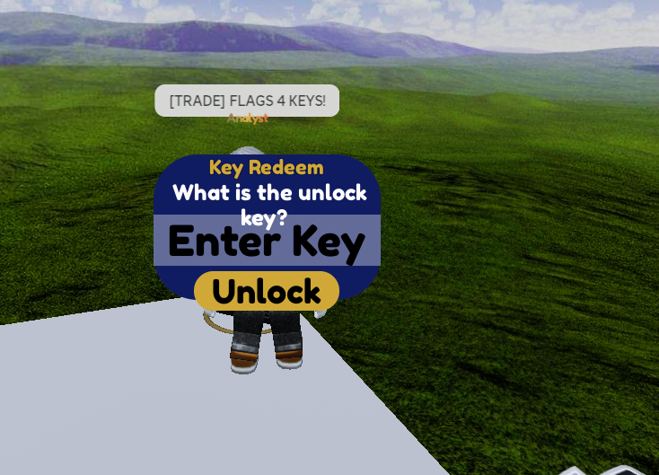
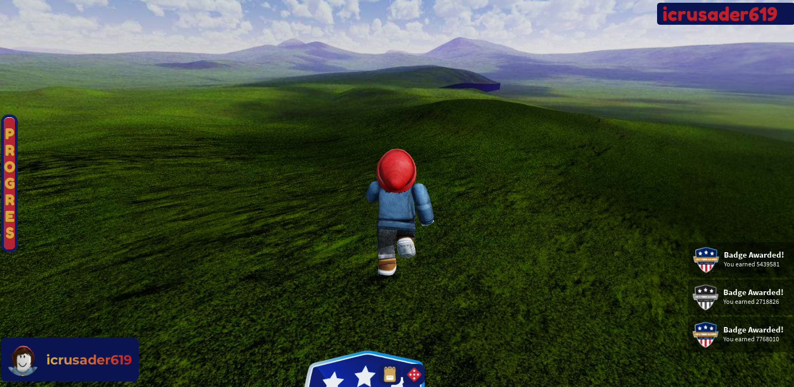
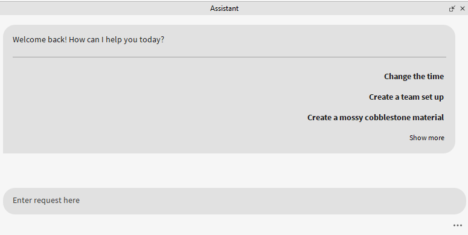
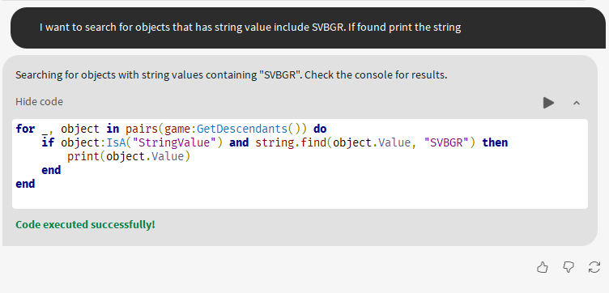
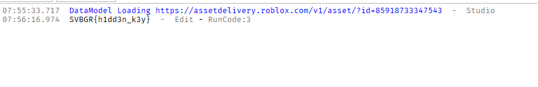
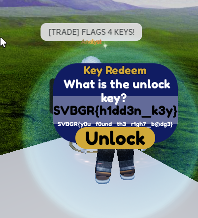

# 🤖 Badge Brigage: A Roblox Forensic Adventure!

The Badge Brigage challenge was one of the most unique puzzles, taking place entirely within Roblox! It was a fun dive into a new environment, though it required a bit of setup first—I had to create a Roblox account and fire up a Windows machine, since Roblox Studio doesn't run on Linux.

---
## 🕵️‍♂️ The Investigation: Step-by-Step

### Step 1️⃣: Exploring the Game World 🌎

My first move was to open the game file in Roblox Studio to see what I was dealing with. The world was simple: a road with two NPCs. One of the NPCs had a prompt that said, "Flags 4 Key" which let me input a string. I tried running down the road to see if anything would happen, but it was a dead end.

### Step 2️⃣: Teaming Up with the AI 🤖

I checked the README file, which gave two huge hints: the game was written in Lua, and more importantly, "THE KEY IS *NOT* THE FLAG. DO NOT SUBMIT IT. ;)
"

I've never worked with Lua before, but luckily, Roblox Studio has a built-in AI assistant. I decided to try a little "prompt engineering" to get the secret string from the game's code. After a few clever prompts, the AI gave me exactly what I asked for—a string that looked just like a flag!

### Step 3️⃣: The "Aha!" Moment💡

I almost submitted the string from the AI as the flag, but then the main hint echoed in my head: "The key is *not* the flag."

It all clicked! The AI hadn't failed or given me a faulty flag. It had done its job perfectly and extracted the secret string from the code. My mistake was assuming that string was the final flag. It was the key!

### Step 4️⃣: Trading for the Flag! 🏁

With this realization, I jumped back into the game. I walked up to the NPC with the "Flags 4 Key" prompt and gave it the key string I got from the AI.

Success! The NPC accepted the key and gave me the real flag for the challenge.

---
## ✅ Conclusion

This challenge was an absolute blast and a great lesson in paying attention to every single detail. My plan to use the AI to get the secret worked perfectly! The real puzzle wasn't in finding the secret string, but in understanding its purpose. It really shows that sometimes you have the right answer (the key) all along, you just have to figure out which lock it opens.
