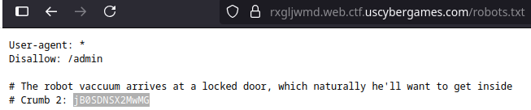

# 🍪 If You Give a Mouse a Cookie: A Web Challenge Walkthrough

This challenge was a super fun scavenger hunt that took me all over a website, piecing together clues to bake the final cookie and get the flag!
## 🛠️ The Recipe for Success: Step-by-Step
### Step 1️⃣: The First Hint

When I first loaded the website, a single hint was waiting for me:

This was a dead giveaway to pop open the developer tools and check the browser's cookies.

### Step 2️⃣: A Base64 Treat 

Inside the cookie storage, I found a suspicious-looking base64 string:

``QWZ0ZXIgaW5zcGVjdGluZyB0aGUgY29udGVudHMsIGhlJ2xsIGhvcCBvbiB0aGUgUk9CT1QgdmFjY3V1bSBwaWNraW5nIHVwIHRoZSBjcnVtYnMgaGUgbWFkZS4KQ3J1bWIgMTogZFY5Q1FHc3paRjloVA==``

Decoding it gave me the next clue and my very first crumb! I first saved the crumb in a file then head to next hint.

### Step 3️⃣: The Robot's Path 

The "ROBOT" hint made me think of one specific file: robots.txt. This file tells search engine crawlers which pages to avoid. Navigating to ``/robots.txt`` paid off, revealing the next hint and the second crumb:

I also noticed it listed a disallowed directory: ``/admin``. Save my second crumb and headed to ``/admin`` page.

### Step 4️⃣: Get through the kitchen door

The ``/admin`` page was a login portal. The usual admin/password combo didn't work. So, I did what any good hacker would do: I inspected the page source! Hidden in the HTML was the third crumb, which I realized was the password for the admin account.

Using admin as the username and the crumb as the password got me in! Now save that third crumb and head inside the "door"!
### Step 5️⃣: Baking Time! 

Inside the ``/kitchen``, I found a README.txt:

While searching around the kitchen, I found a recipe note:

It was time to find the last crumb to "bake" the cookie. A little more searching led me to a Milk.js file, and inside it was the final crumb!

### Step 6️⃣: The Final Cookie & The Flag 

With all the crumbs collected, I pieced them together to form the final cookie string.

The easiest way to use it was to go back to the developer tools, modify the original cookie, paste in my newly baked value, and refresh the page.

Voila! The flag appeared.

## ✅ Conclusion

This challenge was a fantastic and fun guide on how to approach a web-based scavenger hunt. It covered checking cookies, robots.txt, page sources, and even modifying cookies manually. While it was quick, it was a great exercise in following the trail of clues!

