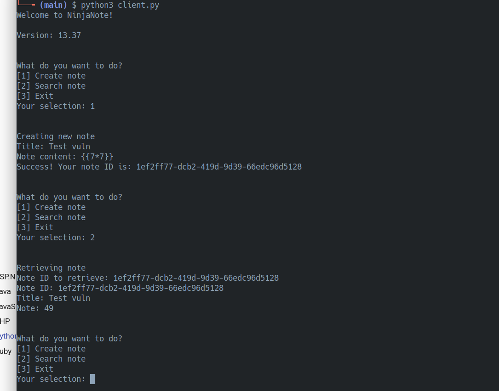
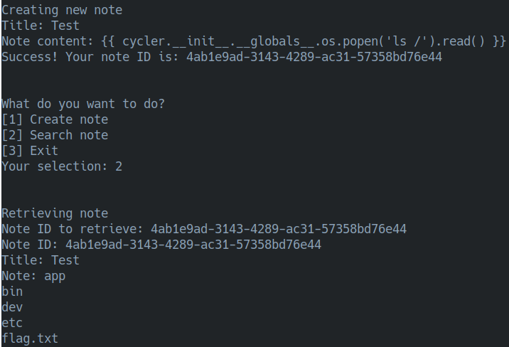
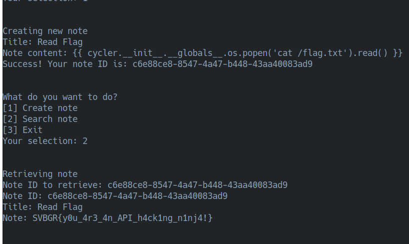

# 🥷 Ninja Note: Hacking with Template Injection!
The Ninja Note challenge gave us a Python client to interact with a note-taking service. The goal was to find a way to exploit the service and grab the flag. The secret to this whole challenge was hiding in plain sight, right inside the `client.py` script they gave us!

## 🕵️‍♂️ The "Aha!" Moment: Spotting the Flaw

When I looked at the `client.py` script, one line basically screamed "I have a vulnerability!":

```python
# Hopefully this should be enough?
note_content = input("Note content: ").replace("{", "").replace("}", "")
```
This is where all that CTF experience paid off! Seeing the code trying to strip out { and } was a dead giveaway for a Server-Side Template Injection (SSTI) exploit. The developer tried a client-side fix, but that's never enough when we can just edit the script ourselves.

## 🧠 My Exploit Strategy: Modify and Conquer!

### Step 1️⃣: Upgrade My Weapon! 

First, I edited my local `client.py` file. I just deleted the `.replace()` part and pointed the `BASE_URL` to the live server instance.

**Before:**
`note_content = input("Note content: ").replace("{", "").replace("}", "")`

**After:**
`note_content = input("Note content: ")`

Also, I changed the BASE_URL to be the instanced url. Now my client could send any payload I wanted, with no restrictions!

### Step 2️⃣: Prove the Vulnerability 

With my modified client, I sent a simple note with the content `{{ 7*7 }}`. I chose to view the note, and the server sent back **`49`**. Boom! SSTI confirmed.



### Step 3️⃣: Time for the Payload Hunt!

Now for the fun part. I headed straight over to the holy grail for payloads: PayloadsAllTheThings. Since this was a Python app, I went to their Python SSTI section:

[Payload Goldmine](https://swisskyrepo.github.io/PayloadsAllTheThings/Server%20Side%20Template%20Injection/Python/)

After testing a few of their payloads, I found one that worked perfectly and gave me code execution. First, lets find our flag.



Found it! It was in a typical CTF spot. With the location confirmed, I used a final payload to read the file and disclose the flag.



## ✅ Conclusion

This challenge was an awesome confidence booster and really solidified my passion for CTFs! It's a great feeling to know that I can now confidently spot an SSTI vulnerability just by looking at the source code. It shows that the practice is paying off and my skills are leveling up!
