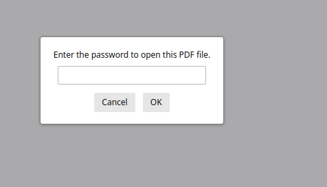
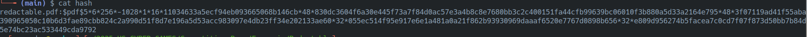
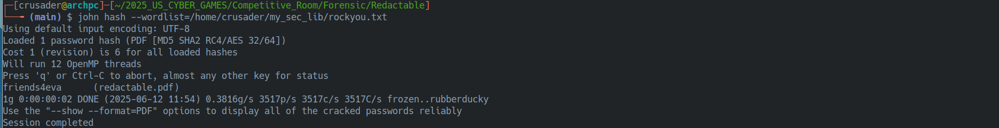
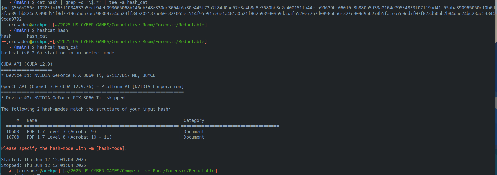
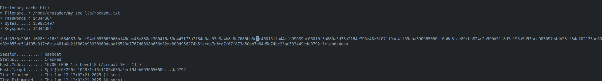
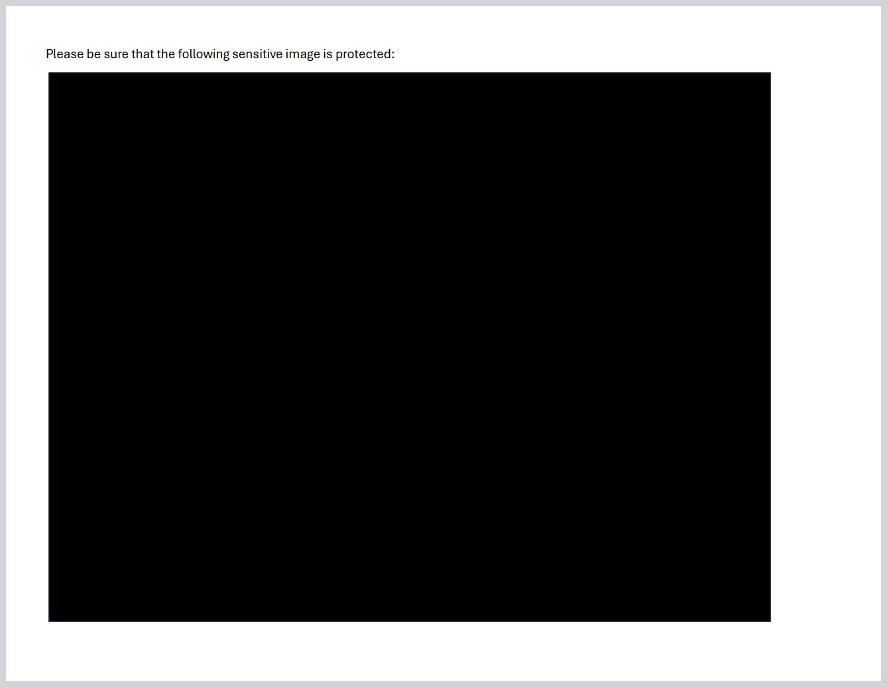
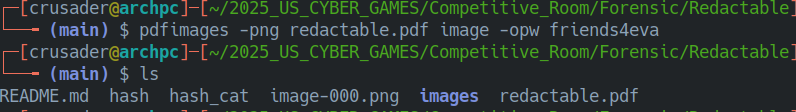
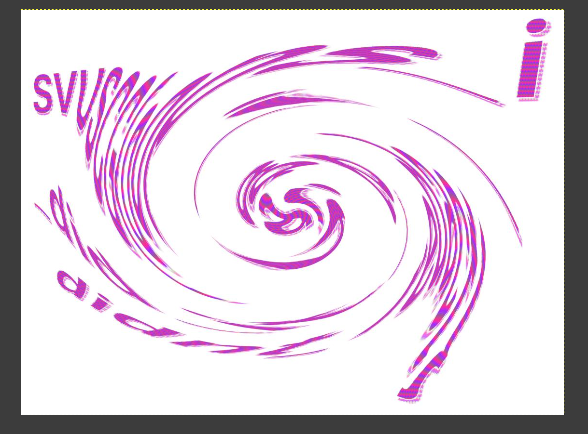
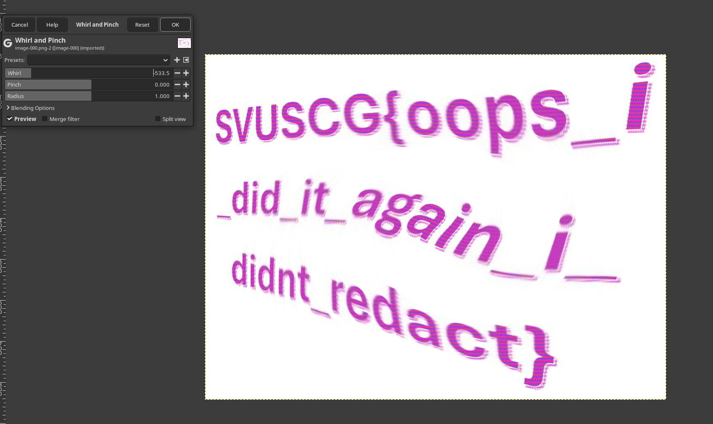

# 📜 Redactable: The PDF Puzzle Write-Up

The Redactable challenge presented us with a locked PDF file. The mission was to break in, extract the contents, and unscramble the secret hidden inside. This one was a fun multi-step journey!

## 🛠️ The Plan of Attack: Step-by-Step

### Step 1️⃣: Crack That Password! 🔑

The first hurdle was the password-protected PDF. Here's how I got past it:



As a ritual for cracking pdf password protected, I used `pdf2john` to pull the password hash right out of the file.
    


With the hash in hand, it was time to crack it. I used John the Ripper, but Hashcat works great too as shown in pictures below:



*Pro Tip for Hashcat User:* If you use Hashcat, you have to clean up the hash first by removing everything before the `$` sign. Then, you run `hashcat hash_file` to let hashcat auto determine what kind of hash that is (it worked 90% of the time unless the password hash is not supported)



In our case, the hash mode was ``10700``



After a short wait, the password was revealed: `friends4eva`.

### Step 2️⃣: Extract the Image 🖼️

Now that I had the password, I could get the goods out of the PDF. However, it turn out we have somekind of image embeded into the pdf



There are couple way to do it, however, I found this useful tool from `poppler` package that is available on most of Linux OS. I can extract stuffs from the pdf using the tool. First, I list the images that is contained in the pdf file by running this command 
```bash
pdfimages -list redactable.pdf -opw friends4eva
```


Now we can extract it using the right extension (Or you can extract to any extension of your choice):

```bash
pdfimages -j redactable.pdf image -opw friends4eva
```


The image is extracted from the PDF, but it looked all scrambled and swirly.



### Step 3️⃣: Un-whirl and Profit! 🌀

After another search online, I foudn that Gimp can *un-whirl* it. I opened it up in GIMP:

    Go to Filters -> Distorts -> Whirl and Pinch.
    I played with the "Whirl" slider, moving it in the opposite direction of the distortion.

After a little adjustment, the image unscrambled perfectly, revealing the flag!



## ✅ Conclusion

This challenge was a fantastic exercise in using a chain of different tools! It wasn't just one thing, but a cool combination of password cracking (pdf2john, john), file extraction (pdfimages), and image manipulation (GIMP). 
