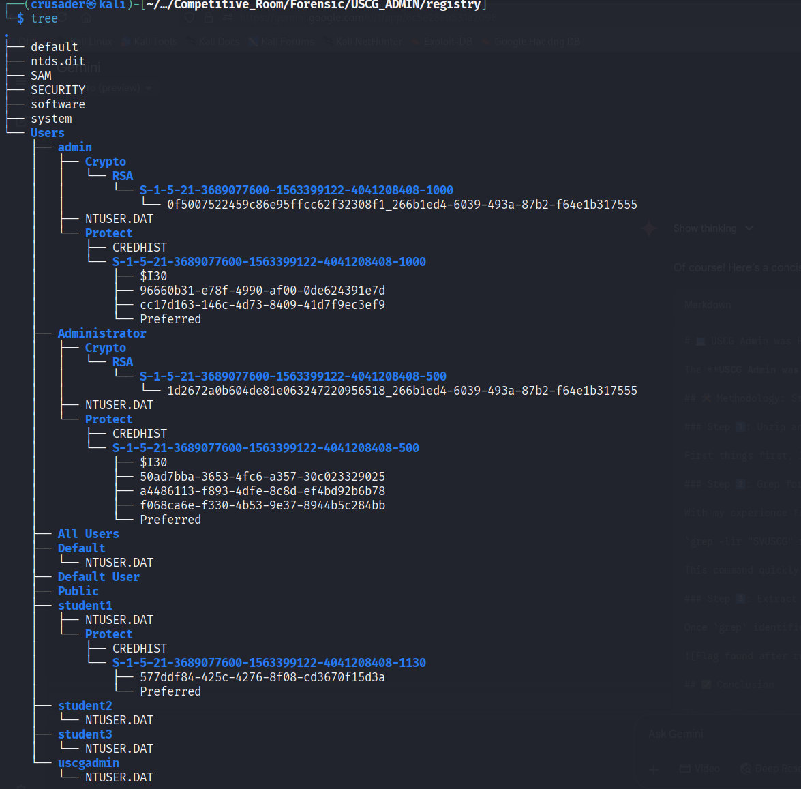
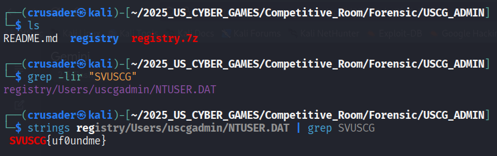

# 💻 USCG Admin was H@cked: Registry Forensics Write-Up

The USCG Admin was H@cked challenge involved diving into a zipped file system to find a hidden flag. Here's the quick and easy way I solved it.

## 🛠️ Methodology: Step-by-Step

### Step 1️⃣: Unzip and Reconnaissance

First things first, I unzipped the file. To get a quick layout of all the files and folders inside, I ran the `tree` command. This gave me a good map of the directory structure. I noticed too many directories and files: 24 directories, 29 files.

### Step 2️⃣: Grep for the Flag Pattern 🕵️

With my experience from other CTFs, I knew a great first step is often to just search for the flag format. I used a simple `grep` command to recursively search all the files for the "SVUSCG" string.

`grep -lir "SVUSCG" registry`

This command quickly pointed me to the exact file containing the flag!
`registry/Users/uscgadmin/NTUSER.DAT`

### Step 3️⃣: Extract and Profit! 🏁

Once `grep` identified the file, I used the `strings` command on it to pull out all the readable text. And just like that, the flag popped right out!

## ✅ Conclusion

This challenge was a great reminder that sometimes the simplest tools are the most effective. A quick `grep` can often save a ton of time and get you straight to the goal!
