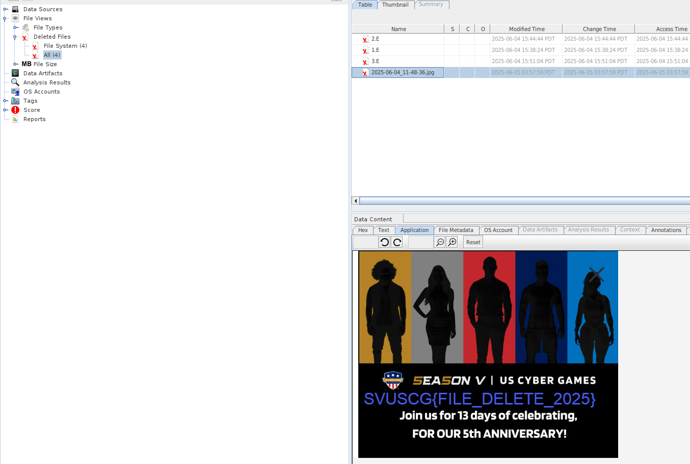

# 🗑️ Deleted Challenge: File Recovery Write-Up

The Deleted challenge was a classic file recovery task. The goal was simple: find and restore a file that had been deleted from the file system.

## 🛠️ Methodology: One Step to Victory!

### Step 1️⃣: Fire up Autopsy 🔥

This challenge was very straightforward. I loaded the provided disk image into `Autopsy`.

Almost immediately, Autopsy's file recovery feature highlighted the deleted files. Among them was a picture that clearly contained the flag.

## ✅ Conclusion

This was a fun, quick challenge that really shows the power of tools like Autopsy. Sometimes, you don't need complex steps—just the right tool to look in the right place!
