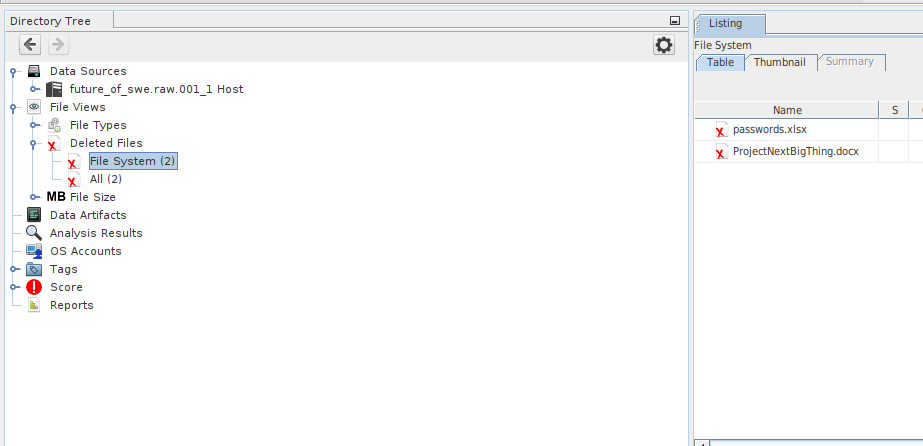
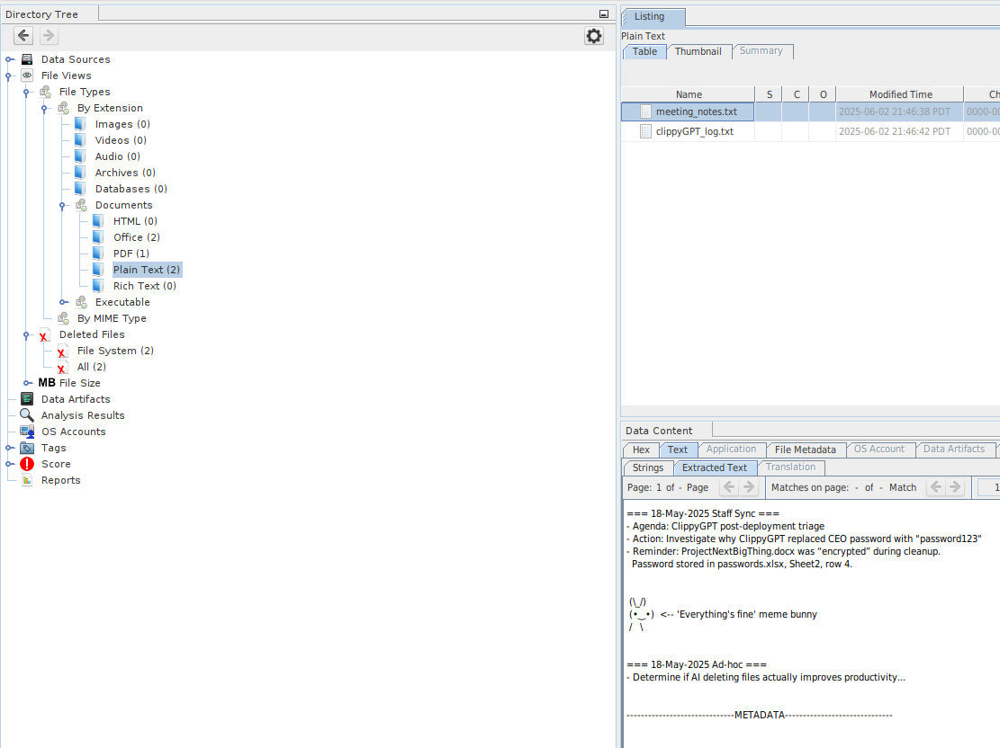
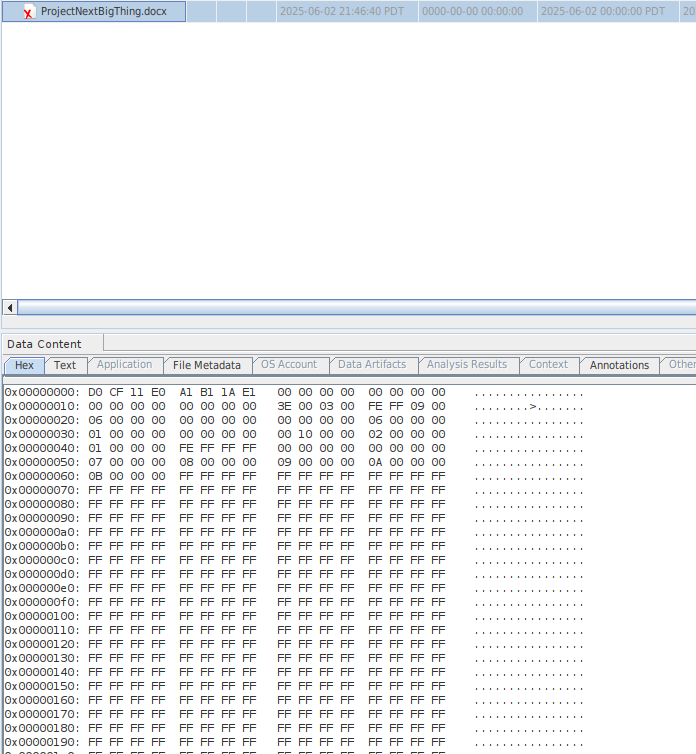
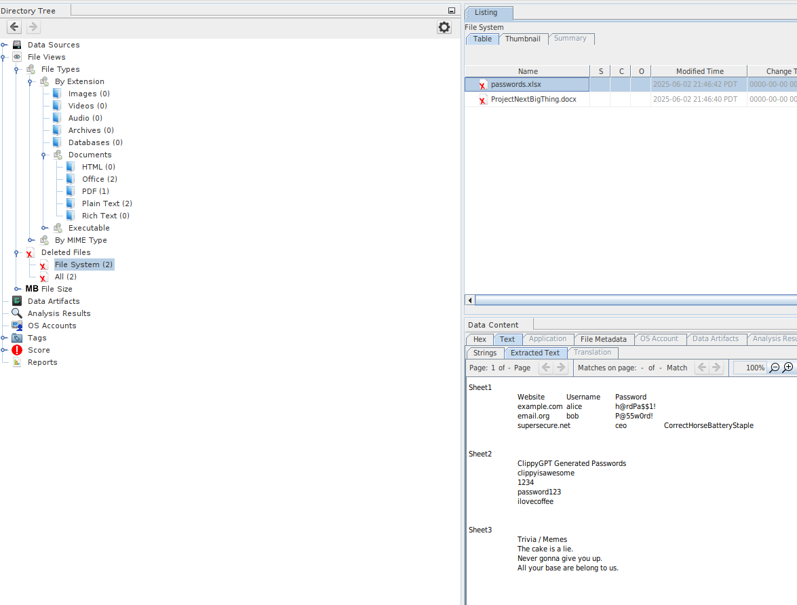
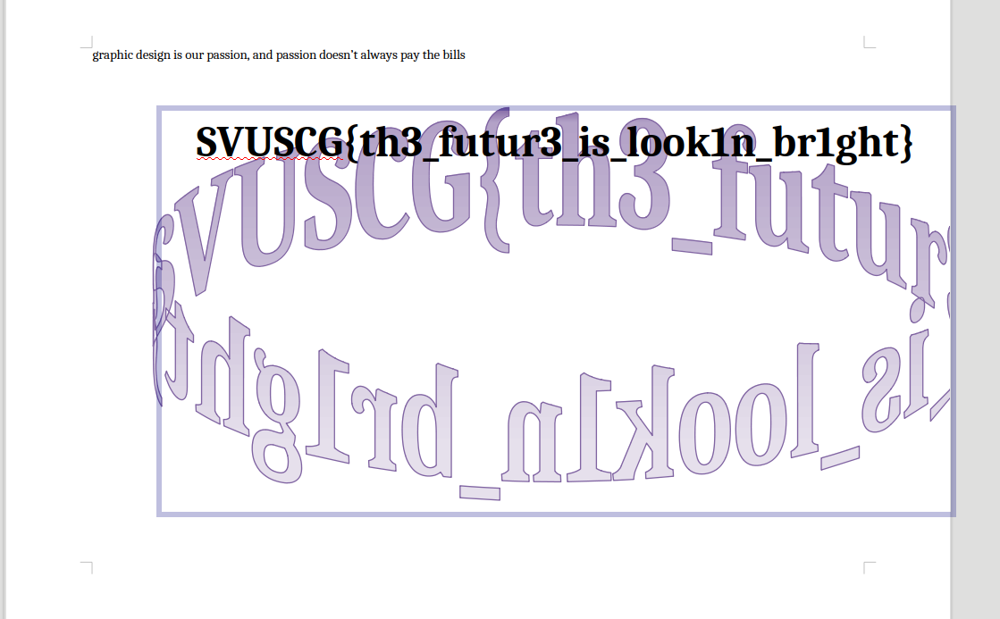

# 🤖 Future Of SWE Challenge: File Recovery Write-Up

The Future Of SWE challenge required the recovery of critical files deleted by an AI, Clippy. The objective was to restore these deleted files and recover the flag from their contents. These are the methodology and steps taken to achieve the solution.

## 🕵️‍♂️ Initial Reconnaissance: Autopsy on Kali Linux

File recovery began with Autopsy, a digital forensics platform. The version I used was the newest interactive GUI application, obtained from the ``snapd store``. This modern version provides a significantly improved and intuitive interface compared to its older, browser-based predecessor. For new users on Kali Linux focusing on forensic analysis, installation of this GUI version via `snapd` is highly recommended in my opinion.

## 📋 Recovery Methodology: Step-by-Step Breakdown

Following the setup of Autopsy, here are the steps I took to solve the challenge:

### Step 1️⃣: Locating Deleted Files

Utilizing Autopsy's capabilities, two crucial deleted files were identified.

### Step 2️⃣: Discovery of Important Files

Further analysis of recovered data revealed a critical note:

As we can see our Docs cannot be read normally as it seems to be encrypted:

### Step 3️⃣: Profit! 🏁

The password mentioned in the note was slightly different. To open the `ProjectNextBigThing.docx` file, the password ``clippyisawesome`` was the one used.

After opening the file, we can see our flag as below:

## ✅ Conclusion

The Future Of SWE challenge was a fun and straightforward exercise in digital forensics! This time, I got to learn about a new tool, Autopsy, and wow, it was so much easier to use compared to FTK Imager, which I used before. It really goes to show that having the right tools for the job makes a huge difference!
