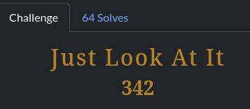
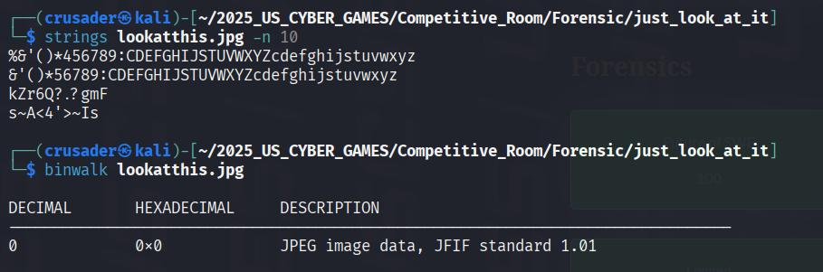
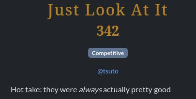
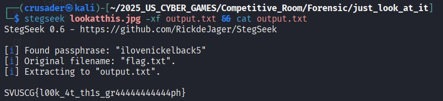

# 🖼️ Just Look At It: The Stego Challenge Write-Up

The Just Look At It challenge was, by far, the most daunting one in the Forensics category. At the time this was written, fewer than 100 people had solved it, and it definitely lived up to its reputation!

## 🕵️ The Initial Struggle

At first glance, it was just a picture file. I threw all my usual tricks at it:

* I ran `strings` to look for any readable text. Nothing.
* I used `binwalk` and `foremost` to see if there were any hidden files compressed or embedded within it. No luck.

I was getting nowhere. So, I took a look at the hint: "Hot take: they were always actually pretty good".

This made me think I was overcomplicating things and needed to go back to steganography basics.

## 🐇 Down the Stego Rabbit Hole

My next step was to try common steganography tools, including the classic command-line tool, `steghide` and a few `steganography` websites. Nothing work. 

## 🛠️ Finding the Right Tool for the Job

I then remember, Steganography use password to hide the secret in pictures and other medias. Therefore, it might need a password to extract the secret. A quick search led me to a tool built for this exact purpose: `stegseek`.

`stegseek` is a powerhouse for extract hidden data from file using a wordlist. I ran it against the image, and in no time, it brute-forced the password and extracted the hidden file containing the flag!

## ✅ Conclusion

So, the lesson from this challenge was about the methodology in cybersecurity: having the right tool is everything! You can be inches from the flag, but without the right key, the door stays locked. It was an awesome reminder to stick to the fundamentals and keep searching for that perfect tool. What a satisfying solve!
