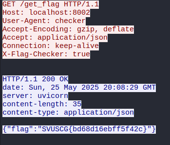
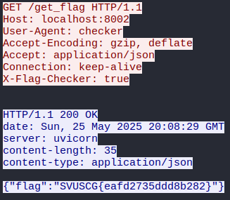
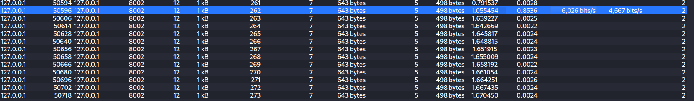
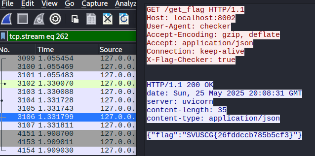

#🕵️ FRAUDSTER: Finding the Needle in a Haystack!

The FRAUDSTER challenge dropped us into a pcap file with 1,000 requests. The mission was to find the one "fraudster" hiding in the crowd and figure out which flag they retrieved.

## 🛠️ The Investigation: Step-by-Step
### Step 1️⃣: Drowning in Flags! 🌊

My first instinct was to use the standard Wireshark trick: right-click a packet and Follow TCP Stream. There was just too much noise. It was impossible to tell which of the many flags was the right one. I needed a new plan.

### Step 2️⃣: Zooming Out with Statistics 📊

Instead of looking at individual streams, I decided to look at the big picture. I used one of Wireshark’s most powerful features: the Conversations window.

Here's the path: ``Statistics -> Conversations -> TCP Tab``

This tool gives a high-level summary of every single TCP conversation in the capture, showing details like IP addresses, ports, and—most importantly—how much data was transferred.

### Step 3️⃣: The Outlier Stands Alone! 🎯

Scrolling through the Conversations list, the answer became incredibly obvious. Among hundreds of entries, only one single conversation showed any transferred bits from both sides. Every other conversation had nothing.

This had to be the fraudster! It was the only session that look different among 1000 of them. I filtered for that specific conversation, followed its TCP stream, and inside was the one, true flag.

## ✅ Conclusion

This challenge was a fantastic lesson in not getting lost in the weeds. When you're overwhelmed by too many details, sometimes the best strategy is to zoom out and see what stands out. 
